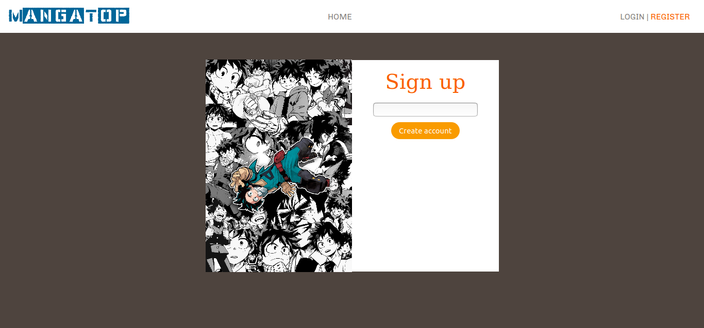
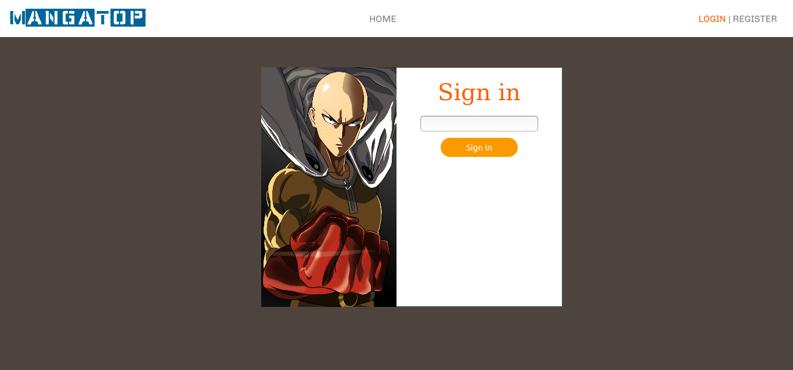
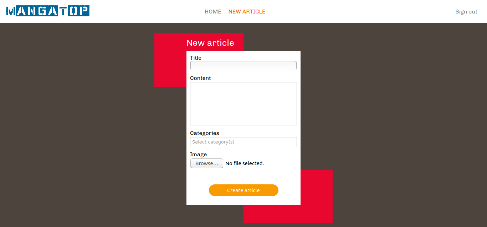
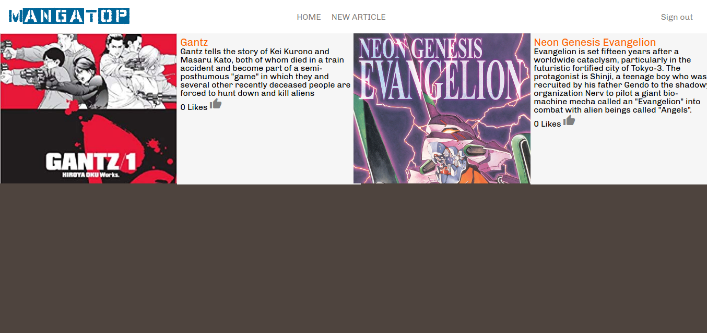

[![Contributors][contributors-shield]][contributors-url]
[![Issues][issues-shield]][issues-url]
 

 
  <h3 align="center">Manga top</h3>
  

    Web page to create reiews of mangas 
     
    <a href="https://github.com/kalavhan/manga-top/"><strong>Explore the docs »</strong></a>
     
     
    ·
    <a href="https://github.com/kalavhan/manga-top/issues">Report Bug</a>
    ·
    <a href="https://github.com/kalavhan/manga-top/issues">Request Feature</a>
  

<!-- TABLE OF CONTENTS -->
## Table of Contents

* [About the Project](#about-the-project)
  * [Built With](#built-with)
* [Use](#use)
* [Roadmap](#roadmap)
* [License](#license)
* [Contact](#contact)

<!-- ABOUT THE PROJECT -->
## About The Project

A basic blog application with simple features
- Login
- Create article
- Vote article
- un-vote article

## Screenshots

### Home page

### Signup page

### Signin page

### Create article page

### Articles per categorie page

### Built With

This project was built with Ruby on rails version 6

## Prerequisites
 - Git
 - Ruby
 - Ruby on rails version 6
 - Yarn
 - Node.js
 - NPM
 - PostgreSQL

## Getting Started

- git clone https://github.com/kalavhan/manga-top.git

- cd manga-top

- bundle update

- bundle install

- rails db:create

- rails db:migrate (to add tables and columns)

- rails db:seed (to add the categories)

- rails server to fire the rails server

<!-- ROADMAP -->
## Roadmap

See the [open issues](https://github.com/kalavhan/manga-top/issues) for a list of proposed features (and known issues).

<!-- LICENSE -->
## License

Distributed under the MIT License. See `LICENSE` for more information.

<!-- CONTACT -->
## Contact
Josue Brigido - [Github profile](https://github.com/kalavhan)

Project Link: [Project repo](https://github.com/kalavhan/manga-top/)

<!-- MARKDOWN LINKS & IMAGES -->
<!-- https://www.markdownguide.org/basic-syntax/#reference-style-links -->
[contributors-shield]: https://img.shields.io/badge/Contributors-1-%2300ff00
[contributors-url]: https://github.com/kalavhan/manga-top/graphs/contributors
[issues-shield]: https://img.shields.io/badge/issues-0-%2300ff00
[issues-url]: https://github.com/kalavhan/manga-top/issues/
